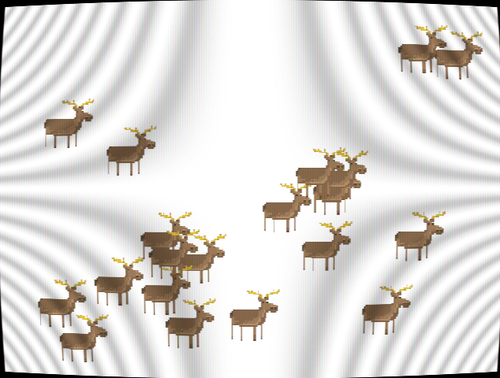

# SDL2 + GLSL example

Fork of [AugustoRuiz/sdl2glsl](https://github.com/AugustoRuiz/sdl2glsl).

Adapted to build with [sakemake](https://github.com/xyproto/sakemake).

## Building

    sm

## Building and running

    sm run

## Exporting QtCreator project

    sm pro
